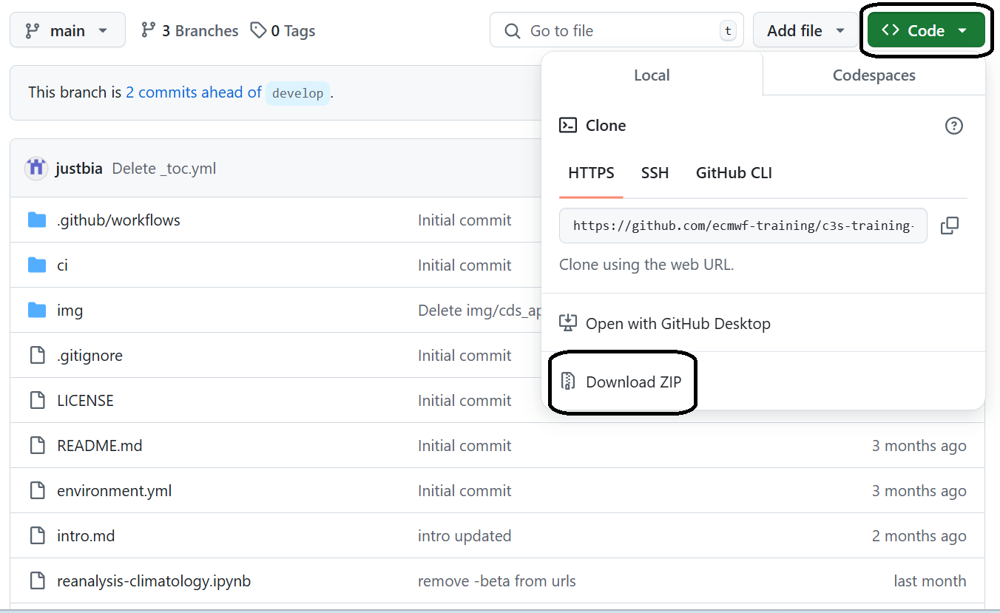
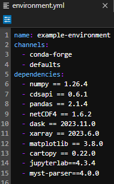
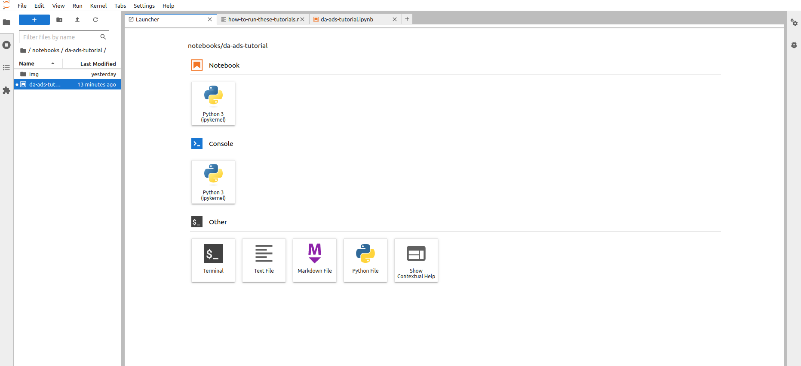

# How to run these tutorials

The tutorials are in the form of [Jupyter notebooks](https://jupyter.org/), a powerful tool for interactive computing. Jupyter notebooks allow you to write and execute code, view the results, and add explanatory text all in one document. They are widely used in data science, research, and education due to their versatility and ease of use.

You will not need to install any software to work with Jupyter notebooks, as there are several free cloud-based services available for creating, editing, running, and exporting notebooks. These services provide a hassle-free environment where you can focus on your analysis without worrying about software installation or compatibility issues.

<hr>

## Possible Cloud-based services

:::{dropdown} WEKEO

[WEKEO](https://www.wekeo.eu/) is the EU Copernicus DIAS reference service for environmental data, virtual processing environments, and skilled user support. It is a platform for all audiences. This is our official platform for accessing the notebooks. You can access every notebook by clicking on the WEkEO link, which will redirect you to our official website. From there, you can open the notebook directly in JupyterHub. You need to be [signed up](https://www.wekeo.eu/register) to access the notebooks.

:::

```{warning}
These free cloud-based services are not supported by ECMWF
```

:::{dropdown} Binder

[](https://mybinder.org/)

```{note}
Binder may take some time to load, so please be patient!
```

1. Click on the Binder badge
2. Wait for the Binder environment to load.
3. Once loaded, navigate to the desired notebook and click on it to open and interact with it.
:::

:::{dropdown} Kaggle

[](https://www.kaggle.com/code)

```{note}
Requires (free) registration with Kaggle. Once in, `switch on the internet` via settings.
```

1. Click on the Kaggle badge
2. If you're not logged in to Kaggle, sign in or create a free account.
3. After signing in, you'll be redirected to the Kaggle notebook interface with the option to open the notebook. Click on it to proceed.

:::

:::{dropdown} Colab

```{note}
Requires Google account, and installation of some libraries, you can add our `requirements.txt` file and install all of them with `pip install -r requirements.txt`
```

[](https://colab.research.google.com/)

1. Click on the Colab badge
2. If prompted, sign in to your Google account.
3. Once signed in, the notebook will open in Google Colab. You can then interact with and run the notebook in the Colab environment.

:::

:::{note}
These cloud-based services represent only a selection of the available options for running notebooks in the cloud. Users can leverage these services to execute Jupyter notebooks without the need to install any software locally. However, it's essential to note that this selection is not exhaustive, and users may explore other cloud-based platforms tailored to their specific needs and preferences.
:::

<hr>

## Run the notebooks locally

### Key Concepts

If you are considering to work with your notebooks locally, it is important that you are aware of some key concepts or information that you'll find in this tutorial or during the preparation and installation process. 

- **Dependencies** are all of the software components required by your notebook in for it to work as intended and avoid runtime errors. They can be libraries, frameworks, or other programs. 

- **Packages** are a way to organize and group together related dependencies. They act like toolboxes, storing and organizing tools making easier to install and manage dependencies.  

- **Conflicting dependencies or dependency hell** are issues that occur when two or more packages that are sharing dependencies in a project, require different versions of the same dependency. Because only a single version 
  of a dependency is permitted in any project's environment.     
 
- **Environments** are directories that contain a specific collection of packages that you have installed. You may have several environments with different versions for the same dependecy. If you change one environment, 
  your other environments are not affected. There is a `base environment` located at the root prefix that contains the system installation parameters.

- **Git** is a distributed version control system that intelligently tracks changes in files. It is particularly useful when you and a group of people are all making changes to the same files at the same time.

- **[GitHub](https://github.com/)** is a cloud-based platform where you can store, share, and work together with others to write code.  

- **A repository** is the most basic element of GitHub. Here you can find and store the code, the files, and each file's revision history. Repositories can have multiple collaborators and can be either public, internal, or 
  private.

- **Terminal** is a text input and ouput environment. It is a program that allows us to enter commands that the computer processess. 

- **Shell** is a program that acts as command-line interpreter. It processes commands from the terminal and outputs the results. It interprets and processes the commands entered by the user.
  
- **The activation** of an environment makes all its contents available to your terminal or shell.

- **The deactivation** of an environment is the opposite operation of activation, removing from your shell what makes the environment content accessible.
 
- **Pip** is the standard tool for installing or uninstalling Python packages and managing their dependencies. For more information visit [pip documentation](https://pip.pypa.io/en/stable/).

- **Conda** is an open-source, cross-platform package manager and environment management system which can be used to create Python and R development environments on many different platforms. It is particularly beneficial 
  for data scientists, researchers, and developers working with diverse software requirements across different projects. For more information visit [Conda Documentation](https://docs.conda.io/projects/conda/en/latest/index.html)
  
- **Conda channels** are the locations where packages are stored. They serve as the base for hosting and managing packages. Remote channels like conda-forge offer a wide range of community- 
  maintained packages, expanding the available options for software development and experimentation.

- **Conda-forge** is a community channels made up of thousands of contributors, which contains repositories of conda recipes and thus provides conda packages 
  for a wide range of software. The `conda-forge` channel is free for all to use. For more information visit [conda-forge documentation](https://conda-forge.org/docs/).


### Download a submodule repository

```{attention}
In our [github repository](https://github.com/ecmwf-training/c3s-training) you can find a set of repositories in the [`submodules/` folder](https://github.com/ecmwf-training/c3s-training/tree/main/submodules) where you can find all the Jupyter Notebooks grouped in several topics as structured in the left menu bar.   
```

If you have experience using [git](https://git-scm.com/downloads), we recommend working with git on the command line to download and get access to the Jupyter Notebooks. If you have never used git, you can download the submodules via the GitHub website.


:::{dropdown} Clone wit git

You will need to have [git](https://git-scm.com/downloads) installed to follow the steps below.

Here we show how to download the [reanalysis submodule repository](https://github.com/ecmwf-training/c3s-training-submodule-reanalysiry as an example, but you can follow the same steps for any other [submodule repository](https://github.com/ecmwf-training/c3s-training/tree/main/submodules).

1. Open a terminal

2. Clone the repository with

    ```bash
    git clone https://github.com/ecmwf-training/c3s-training-submodule-reanalysis.git
    ```

    **or** (alternatively) use ssh if you have access configured for your GitHub account:

    ```bash
    git clone git@github.com:ecmwf-training/c3s-training-submodule-reanalysis.git
    ```

3. Move into the cloned directory

```bash
cd ecmwf-training/c3s-training-submodule-reanalysis
```
:::


:::{dropdown} Download from GitHub website

1. Go to the [`submodules/` folder](https://github.com/ecmwf-training/c3s-training/tree/main/submodules) and pick the submodule repository you want to download, e.g. [reanalysis submodule repository](https://github.com/ecmwf-training/c3s-training-submodule-reanalysis).

2. First click on the {bdg-success}`<> Code` button and then Download ZIP file.

 
 
3. Unzip the file using your favourite tools

4. Open a terminal inside the unzipped folder


:::  


### Conda installation

If you would like to run the notebooks in your own environment, we suggest you use [Conda](https://docs.conda.io/projects/conda/en/latest/index.html). Using conda provides a streamlined approach to package management, platform compatibility, environment isolation, and access to an extensive package ecosystem. Conda is available on Windows, macOS, or Linux and can be used with any terminal application (or shell). 

We suggest you use the [Miniforge](https://conda-forge.org/download/) installer, that is maintained by the conda-forge community that comes preconfigured for use with the conda-forge channel.

Basic installations instructions are available below. More detailed instructions are available in this [github repository](https://github.com/conda-forge/miniforge). 

**Unix-like platforms (Mac OS & Linux)**
 
Download the installer from [Miniforge](https://conda-forge.org/download) and run from the terminal `bash Miniforge3-$(uname)-$(uname -m).sh`.


**Windows**

Download and execute the Windows installer from [Miniforge](https://conda-forge.org/download).


```{note}
There are several installers that you could use to install Conda. For more information about that visit [Installing conda](https://docs.conda.io/projects/conda/en/latest/user-guide/install/index.html)
```


### Setting a virtual environment

In our notebooks we use packages that don't come as part of the standard dependencies of Python and some of these packages need specific dependency versions that could be in conflict with other applications or projects in our local environment. The solution to this problem is to create an environment where we are able to set up the versions and conditions to the relevant dependencies. You can easily activate or deactivate environments, which is how you switch between them. You can also share your environment with someone by giving them a copy of your `environment.yml` file.

With conda, you can create, export, list, remove, and update environments that have different versions of Python and/or packages installed in them. Switching or moving between environments is called activating the environment. You can also share an environment file. For more information about that visit [Managing environments](https://docs.conda.io/projects/conda/en/latest/user-guide/tasks/manage-environments.html)

In all our [github repositories](https://github.com/ecmwf-training/c3s-training) you can find a `environment.yml` file, containing the conda channels and a list of python dependencies needed for running our notebooks, as presented in the figure below. 

 

The list of dependencies are presented with their relevant and required version in a format “dependency_name == version”. You can specify the version of a dependency using `==`,`>`,`>=`,`<`, `<=`, and so on. Omitting the version specifier installs the latest version.

To create an environment with all the dependencies listed in the `environment.yml` file you will need to use the terminal following the next steps. 

1. Create the environment from the environment.yml file. The first line of the `environment.yml` file sets the new environment's name. 
   `conda env create -f environment.yml`  

2. Activate the environment file.
   `conda activate example-environment`

3. Verify that the environment is installed correctly and check the list of environments available.
   `conda env list`


```{note}
To deactivate an environment, type in the command line: `conda deactivate
````


### Installing additional dependencies

In addition to the dependencies installed trought the `environment.yml` file, there are some additional dependencies that may be required for some particular notebooks and that are not avaliable trought the channels defined in the `environment.yml` file. 

Those dependecies are installed in each particular notebook through the [conda install](https://docs.conda.io/projects/conda/en/stable/commands/install.html) command or through the [pip install](https://pip.pypa.io/en/stable/cli/pip_install/) command.

**[conda install](https://docs.conda.io/projects/conda/en/stable/commands/install.html)** is the conda installer command that allows you to install a list of packages and softwares into a specified conda environment.

**[pip install](https://pip.pypa.io/en/stable/cli/pip_install/)** is the Python installer command that allows you to install Python packages and that it is presented in some Jupyter Notebooks due to particular dependencies that are not available trough the conda installer. 


### Visualization of Notebooks

To visualize and execute the notebooks, we recommend using [JupyterLab](https://jupyter.org/), a versatile web-based interactive development environment. You can interact with our notebooks in this environment locally. JupyterLab is one of the dependencies listed in the `environment.yml` file presented in the repository and it is installed as soon as you install and activate the environment. 


:::{note}
If you prefer a lightweight interface and want to consume less resources, you may consider downloading Jupyter Notebook instead of JupyterLab. Jupyter Notebook provides a basic yet efficient environment for running your notebooks without consuming as many resources. It's a great option for users who prioritize simplicity and performance in their workflow. Here's documentation of [Jupyter Notebook](https://docs.jupyter.org/en/latest/start/index.html)
:::

1. **Launch JupyterLab**:

   - After installing JupyterLab, open your terminal or command prompt.
   - Type `jupyter lab` and press Enter to launch JupyterLab. This will start a local server and open JupyterLab in your default web browser.

   Check the [JupyterLab documentation](https://jupyterlab.readthedocs.io/en/latest/getting_started/starting.html)!

2. **Access JupyterLab Interface**:

   - Once JupyterLab is launched, you will see the JupyterLab interface in your web browser. It consists of a file browser on the left and a main work area on the right.

   3

3. **Open a Notebook**:
   - Navigate to the directory where your notebook is located using the file browser on the left.
   - Click on the notebook file (usually with a `.ipynb` extension) to open it in JupyterLab.
   - The notebook will open in a new tab within the main work area of JupyterLab.4

4. **Interact with the Notebook**:
   - You can now interact with the notebook by running code cells, editing text, and executing various commands.
   - To run a code cell, select it and either click the "Run" button in the toolbar or press Shift + Enter.
   - Explore the different features of JupyterLab to customize your workflow and make the most out of your notebook experience.

```{note}
These tutorials provide practical guides on how to work with C3S data. They can be run without need for installation, and can be fully adapted to suit your needs!
```
