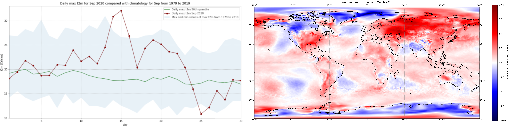

 

# Copernicus Climate Change Service (C3S) data tutorials

**_Discover how to access and handle data of the past, present and future climate!_**

This website contains Jupyter notebook based tutorials that demonstrate how to access and process the wide variety of climate data provided by the [Climate Data Store (CDS)](https://cds.climate.copernicus.eu/) of the [Copernicus Climate Change Service (C3S)](https://climate.copernicus.eu/). Each tutorial provides interactive examples of common workflows used to derive information about the past, present and future climate. They provide clear, engaging and practical instructions on data handling, provided as code in Python and content in Markdown, which can be run in various cloud environments without any need for installation. The tutorials make use of climate data freely available on the CDS and accessed using an Application Programming Interface (API).
We invite you to explore and experiment with them, and tailor them to your needs to extract results that are meaningful to you!

 

## Target audience

The Jupyter notebooks provided by the Copernicus Climate Change Service (C3S) are designed for a diverse audience interested in climate data analysis. This includes climate scientists, researchers and data analysts seeking to understand and interpret climate data. Additionally, educators and students aiming to enhance their knowledge of climate data processing will find these tutorials beneficial.

It is expected that users have a foundational level of python and expereince working in a Jupyter environment when running the Notebooks.

 

## Learning objectives

Through these Jupyter notebooks, you will:

- Equip yourself with practical skills in accessing, exploring, processing, and analysing climate data from the C3S Climate Data Store (CDS);
- Learn how to handle data pertaining to observations, reanalysis, seasonal forecasts and climate projections, using examples coded in Python;
- Implement example workflows that can be tailored by you to suit your needs for climate data analysis. 

 

## New tutorials

We have a set of new tutorials waiting and ready to be explored.

::::{grid} 1 2 3 3

:::{card} A hands-on notebook exploring precipitation using the GIRAFE dataset (Tutorial)
:link: https://github.com/ecmwf-training/c3s-training-submodule-sat-obs-atmos-physics/blob/main/precipitation-girafe.ipynb

**Tags:** Climate, Change, Service, C3S

**Year:** 2025
:::

:::{card} Compute and analyse water-level indicators from the GTSMIP context (Tutorial)
:link: https://github.com/ecmwf-training/c3s-training-submodule-climate-indices/blob/main/gtsmip-water-levels.ipynb

**Tags:** Climate, Change, Service, C3S

**Year:** 2025
:::

:::{card} Derive and visualise a compound climate indicator: warm-and-wet days (Tutorial)
:link: https://github.com/ecmwf-training/c3s-training-submodule-climate-indices/blob/main/warm-and-wet-days-indicator.ipynb

**Tags:** Climate, Change, Service, C3S

**Year:** 2025
:::

::::
